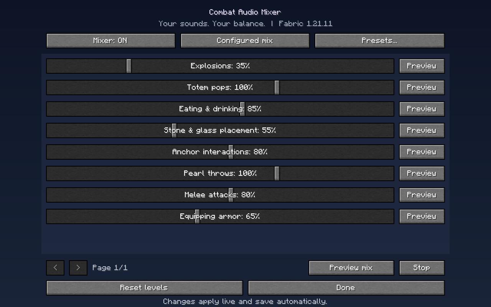

# Combat Audio Mixer

A client-side Fabric mod for Minecraft Java that gives you live, per-group volume control over combat-relevant vanilla sounds. Eight sound groups mapped over 27 vanilla sounds, live 0-150% sliders, previews, presets, and local JSON preset sharing. Requires no server plugin or hosted service.



## Downloads

| Minecraft | Fabric Loader | Fabric API | Java | Download |
| --- | --- | --- | --- | --- |
| 1.21.11 | 0.18.4+ | 0.141.6+1.21.11 | 21+ | [combat-audio-mixer-1.0.0+mc1.21.11.jar](1.21.11/jars/combat-audio-mixer-1.0.0+mc1.21.11.jar) |
| 26.3 | 0.19.5+ | 0.161.0+26.3 | 25+ | [combat-audio-mixer-1.0.0+mc26.3.jar](26.3/jars/combat-audio-mixer-1.0.0+mc26.3.jar) |

A `SHA256SUMS.txt` sits next to each jar: [1.21.11/jars/SHA256SUMS.txt](1.21.11/jars/SHA256SUMS.txt) and [26.3/jars/SHA256SUMS.txt](26.3/jars/SHA256SUMS.txt).

## Features

- Eight sound groups mapped over 27 explicitly documented vanilla sound events.
- Live 0-150% gain sliders per group: 100% is unchanged, 0% mutes, 150% is the ceiling. Master and category muting stay respected.
- Individual per-group previews plus an overlapping combat mix preview (two explosions, a totem, food, an anchor charge, a pearl throw).
- Neutral, Focus, and Quiet built-in presets. They are starting points, not a universally optimal competitive mix.
- JSON presets via clipboard import/export and drag-and-drop of exactly one file onto the Presets screen; unknown groups are skipped with a visible notice.
- Adjustments apply to sounds that are already playing, not only to new ones.
- Temporary "Configured mix / Original audio" comparison bypass (not saved across restarts).
- F8 hotkey, the client command `/combataudio`, and an **Options -> Music & Sound -> Combat Audio Mixer...** entry all open the mixer.
- Fully client-side. It does not require a Minecraft server plugin or a hosted service.

## Quick start

- **1.21.11:** use a 1.21.11 instance with Fabric Loader 0.18.4+ and Fabric API 0.141.6+1.21.11, put the jar above in its `mods` folder, and start the game. Java 21 or newer is required.
- **26.3:** use a 26.3 instance with Fabric Loader 0.19.5+ and Fabric API 0.161.0+26.3, same steps, with Java 25 or newer.

Then open **Options -> Music & Sound -> Combat Audio Mixer...**, press **F8** in a world, or run `/combataudio`. Each version targets its Minecraft release exactly and does not install into your game automatically. Details: [1.21.11/README.md](1.21.11/README.md), [26.3/README.md](26.3/README.md).

## How it works

The gain hook is applied after the original volume has already been used for Minecraft's hearing-distance volume calculation, so pitch, position, hearing radius, and attenuation mode are left intact. The 150% ceiling and per-source clamp are a gain, not a compressor or a combined-output loudness limiter — many overlapping sounds can still be loud. Live updates refresh sound sources that are already playing. A sound skipped because it began at zero volume is not retroactively replayed when unmuted. Resource packs keep control of the actual samples for the supported event IDs; sound events introduced by other mods are outside this version's mapping.

The explosion group uses Minecraft's shared generic explosion event, so it also affects anchors, TNT, and any other source using that event. The mod does not infer whether a sound came from your opponent or from a hidden entity.

## Repository layout

```text
README.md
LICENSE                 MIT
1.21.11/                Mod source for Minecraft 1.21.11 (Yarn mappings)
  jars/                 Prebuilt jar + SHA256SUMS.txt
26.3/                   Mod source for Minecraft 26.3 (official Mojang mappings)
  jars/                 Prebuilt jar + SHA256SUMS.txt
```

Per-version documentation:

- [1.21.11/README.md](1.21.11/README.md)
- [26.3/README.md](26.3/README.md)
- [1.21.11/SUPPORTED-SOUNDS.md](1.21.11/SUPPORTED-SOUNDS.md) — complete 27-event list
- [26.3/SUPPORTED-SOUNDS.md](26.3/SUPPORTED-SOUNDS.md) — complete 27-event list

## Building from source

Use JDK 21 or a compatible newer JDK for the `1.21.11` folder, and JDK 25 for the `26.3` folder. Dependencies and Minecraft development assets are downloaded on the first build.

Windows:

```powershell
.\gradlew.bat build
```

Linux/macOS:

```sh
./gradlew build
```

Run tests with `gradlew test` (25 unit tests per version). Each folder's README covers pinned Loom/Gradle versions, `runClient`, and an opt-in smoke test under `validation`.

## Scope and disclaimers

- This mod is client-side only. It makes no gameplay, packet, or hit-registration changes.
- All game tests used a separate development client. No public-server fight or multiplayer anti-cheat certification is claimed.
- Local files live under your instance's `config/combat-audio-mixer/` directory (`config.json` and `presets/<name>.json`).

## License

Combat Audio Mixer is MIT licensed (see [LICENSE](LICENSE)). Fabric API is a separate upstream dependency distributed under Apache-2.0; Minecraft, its assets, Fabric, and Gradle retain their respective ownership and licenses.

## Version note

The 26.3 port is compiled against official Mojang mappings (the game is unobfuscated since 26.1); both versions use the same event-to-group mapping, so JSON presets are cross-compatible between them.
